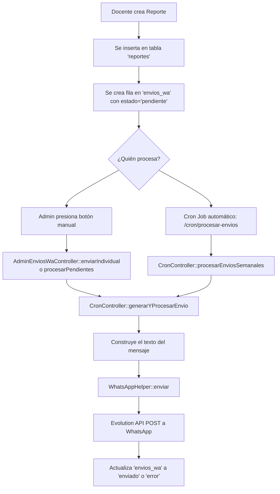

# 📚 EduNexo — Documentación del Sistema

Sistema web académico para el **seguimiento de estudiantes** y **envío de reportes semanales a tutores vía WhatsApp**, usando [Evolution API](https://github.com/EvolutionAPI/evolution-api).

---

## 🗂️ Estructura General del Proyecto

```
edunexo/
├── public/              ← Punto de entrada (Front Controller)
│   ├── index.php        ← Router principal, maneja TODAS las rutas
│   ├── css/             ← Estilos globales
│   ├── .htaccess        ← Redirige todo a index.php
│   └── migrate.php      ← Utilidad de migración de base de datos
│
├── app/
│   ├── config/          ← Configuración de conexión a BD
│   │   └── Database.php
│   ├── controllers/     ← Lógica de negocio (18 archivos)
│   ├── helpers/         ← Utilidades reutilizables
│   ├── models/          ← Modelos de datos
│   └── views/           ← Interfaz visual (HTML/PHP)
│       ├── admin/       ← Vistas del panel Administrador
│       ├── docente/     ← Vistas del panel Docente
│       ├── auth/        ← Login / Registro
│       ├── dashboard/   ← Dashboard por rol
│       └── layouts/     ← Cabeceras y plantillas compartidas
│
├── database/            ← Scripts SQL
├── edunexo_completo.sql ← Volcado completo de la BD
└── start-evolution.bat  ← Script para levantar Evolution API
```

---

## 🔁 Cómo Funciona el Router

**Archivo:** [`public/index.php`](file:///c:/laragon/www/edunexo/public/index.php)

Todo pasa por acá. El `.htaccess` redirige cualquier URL a `index.php`, que lee `$_GET['url']` y hace un `switch` para elegir qué controlador ejecutar. También gestiona:
- ✅ Sesiones y timeout (2 horas)
- ✅ Token CSRF global para todos los formularios
- ✅ Autoloader de clases (namespace `App\`)

---

## 🏗️ Roles del Sistema

| Rol | Descripción |
|-----|-------------|
| `admin` | Panel completo: gestión de usuarios, cursos, materias, tutores, reportes, envíos WA |
| `docente` | Registra asistencia, notas, reportes y ve sus envíos WA |

---

## 🟢 WHATSAPP — El Mensaje Predeterminado

> **Esta es la parte que más te interesa.**

### ¿Dónde se construye el mensaje?

📄 **[`app/controllers/CronController.php`](file:///c:/laragon/www/edunexo/app/controllers/CronController.php) — Líneas 69–152**

El método `generarYProcesarEnvio()` construye dinámicamente el texto completo del mensaje. Así queda el mensaje final:

```
Hola {NombreTutor}, le enviamos el reporte semanal de {NombreEstudiante} — semana del {dd/mm/YYYY} al {dd/mm/YYYY}.

ASISTENCIA:
- Ausencias no justificadas: X
- Fechas de ausencia: dd/mm, dd/mm
- Ausencias justificadas: X

CALIFICACIONES:
- [Materia]: [TipoEval] "Título" — puntaje/máximo

OBSERVACIONES:
- [Materia]: texto de observación

AVISOS:
- [dd/mm/YYYY]: [Título del aviso] — descripción

Este es un mensaje automatico del sistema, por favor no responda a este chat.
Ante cualquier consulta, comuniquese con la secretaria del colegio al {telefonoColegio}.
EduNexo — {NombreColegio}
```

### ¿Dónde están cada parte del mensaje?

| Línea(s) | Sección del mensaje |
|----------|-------------------|
| **L.74** | Saludo inicial con nombre del tutor y estudiante |
| **L.84–93** | Bloque de ASISTENCIA (ausencias justificadas/no justificadas) |
| **L.118–124** | Bloque de CALIFICACIONES |
| **L.122–124** | Bloque de OBSERVACIONES |
| **L.140–147** | Bloque de AVISOS |
| **L.150–152** | Pie de mensaje + teléfono del colegio + firma "EduNexo — Nombre Colegio" |

### ¿Quién envía realmente el mensaje?

📄 **[`app/helpers/WhatsAppHelper.php`](file:///c:/laragon/www/edunexo/app/helpers/WhatsAppHelper.php)**

- Método `enviar()` — Hace la llamada HTTP (cURL) a Evolution API
- Limpia el número telefónico, obtiene credenciales de la tabla `configuracion` de la BD, y hace POST a `http://localhost:8080/message/sendText/{instancia}`
- Constantes por defecto: `DEFAULT_API_URL = 'http://localhost:8080'`, `DEFAULT_API_KEY = 'edunexo_secret_key_2026'`, `DEFAULT_INSTANCE = 'edunexo'`

---

## 📋 Flujo Completo de un Envío WA



---

## 🗂️ Controladores — Qué hace cada uno

| Archivo | Ruta(s) | Función Principal |
|---------|---------|-------------------|
| [`AuthController.php`](file:///c:/laragon/www/edunexo/app/controllers/AuthController.php) | `/login`, `/register`, `/logout` | Autenticación y sesiones |
| [`DashboardController.php`](file:///c:/laragon/www/edunexo/app/controllers/DashboardController.php) | `/dashboard` | Dashboard por rol (admin/docente) |
| [`AdminUsuariosController.php`](file:///c:/laragon/www/edunexo/app/controllers/AdminUsuariosController.php) | `/admin/usuarios` | ABM de usuarios del sistema |
| [`AdminEstudiantesController.php`](file:///c:/laragon/www/edunexo/app/controllers/AdminEstudiantesController.php) | `/admin/estudiantes` | ABM de estudiantes |
| [`AdminTutoresController.php`](file:///c:/laragon/www/edunexo/app/controllers/AdminTutoresController.php) | `/admin/tutores` | ABM de tutores (padres/madres) |
| [`AdminCursosController.php`](file:///c:/laragon/www/edunexo/app/controllers/AdminCursosController.php) | `/admin/cursos` | ABM de cursos/grados |
| [`AdminMateriasController.php`](file:///c:/laragon/www/edunexo/app/controllers/AdminMateriasController.php) | `/admin/materias` | ABM de materias |
| [`AdminAsignacionesController.php`](file:///c:/laragon/www/edunexo/app/controllers/AdminAsignacionesController.php) | `/admin/asignaciones` | Asignar docentes a curso+materia |
| [`AdminTipoEvaluacionController.php`](file:///c:/laragon/www/edunexo/app/controllers/AdminTipoEvaluacionController.php) | `/admin/tipos_evaluacion` | Tipos de evaluación (examen, tarea, etc.) |
| [`AdminReportesController.php`](file:///c:/laragon/www/edunexo/app/controllers/AdminReportesController.php) | `/admin/reportes` | Ver y gestionar todos los reportes |
| [`AdminEnviosWaController.php`](file:///c:/laragon/www/edunexo/app/controllers/AdminEnviosWaController.php) | `/admin/envios-wa` | **Panel WA: ver, enviar, test directo** |
| [`AdminConfiguracionController.php`](file:///c:/laragon/www/edunexo/app/controllers/AdminConfiguracionController.php) | `/admin/configuracion` | Nombre colegio, teléfono, credenciales Evolution API |
| [`AdminLogsController.php`](file:///c:/laragon/www/edunexo/app/controllers/AdminLogsController.php) | `/admin/logs` | Logs de validación de envíos |
| [`DocenteGestionController.php`](file:///c:/laragon/www/edunexo/app/controllers/DocenteGestionController.php) | `/docente/*` | Asistencia, reportes, envíos WA docente, avisos, perfil |
| [`DocenteEvaluacionesController.php`](file:///c:/laragon/www/edunexo/app/controllers/DocenteEvaluacionesController.php) | `/docente/evaluaciones` | ABM de evaluaciones por materia |
| [`DocenteNotasController.php`](file:///c:/laragon/www/edunexo/app/controllers/DocenteNotasController.php) | `/docente/notas` | Carga masiva de calificaciones |
| [`DocenteMateriasController.php`](file:///c:/laragon/www/edunexo/app/controllers/DocenteMateriasController.php) | `/docente/materias` | Ver materias asignadas |
| [`CronController.php`](file:///c:/laragon/www/edunexo/app/controllers/CronController.php) | `/cron/procesar-envios` | **Motor de envíos WA automáticos** |

---

## 🛠️ Helpers — Utilidades

| Archivo | Qué hace |
|---------|----------|
| [`WhatsAppHelper.php`](file:///c:/laragon/www/edunexo/app/helpers/WhatsAppHelper.php) | Envía mensajes via Evolution API. Consulta estado de instancia. Lee credenciales de la BD |
| [`SecurityHelper.php`](file:///c:/laragon/www/edunexo/app/helpers/SecurityHelper.php) | Genera/valida tokens CSRF. Sanitiza inputs. Protección XSS |

---

## ⚙️ Configuración — Dónde se guardan los datos de Evolution API

Los datos de la API se guardan en la **tabla `configuracion` (id=1)** de la base de datos y se editan desde el panel admin en `/admin/configuracion`:

| Campo en BD | Descripción | Valor por defecto |
|-------------|-------------|-------------------|
| `instancia_evolution` | Nombre de la instancia en Evolution API | `edunexo` |
| `url_evolution` | URL base del servidor | `http://localhost:8080` |
| `apikey_evolution` | API Key de autenticación | `edunexo_secret_key_2026` |
| `telefono_wa_remitente` | Teléfono del colegio (aparece en el pie del mensaje WA) | — |
| `nombre_colegio` | Nombre del colegio (aparece en el pie del mensaje WA) | — |

> [!TIP]
> Si querés cambiar el **texto del pie de mensaje** o cualquier otra sección del mensaje WA, editá directamente el método `generarYProcesarEnvio()` en [`CronController.php`](file:///c:/laragon/www/edunexo/app/controllers/CronController.php) a partir de la **línea 69**.

---

## 🗄️ Tablas Principales de la BD

| Tabla | Descripción |
|-------|-------------|
| `usuarios` | Docentes y admins del sistema |
| `estudiantes` | Alumnos |
| `tutores` | Padres/madres/encargados |
| `tutores_estudiantes` | Relación tutor ↔ estudiante |
| `cursos` | Grados/cursos del colegio |
| `materias` | Asignaturas |
| `curso_materia_docente` | Qué docente enseña qué materia en qué curso |
| `asistencias` | Registro de presencia/ausencia por fecha |
| `evaluaciones` | Evaluaciones creadas por los docentes |
| `notas` | Calificaciones de los estudiantes |
| `reportes` | Reportes semanales generados por docentes |
| `envios_wa` | Cola y estado de cada envío por WhatsApp |
| `avisos` | Avisos publicados por docentes para los cursos |
| `configuracion` | Configuración global del sistema (Evolution API, datos colegio) |
| `logs_validacion` | Log de intentos de envío y validaciones de teléfono |
| `solicitudes_cambio_reportes` | Solicitudes de edición fuera del plazo de 48h |

---

## 🔗 Rutas Clave del Sistema

| URL | Descripción |
|-----|-------------|
| `/edunexo/login` | Inicio de sesión |
| `/edunexo/dashboard` | Panel según rol |
| `/edunexo/admin/envios-wa` | **Panel de envíos WhatsApp (admin)** |
| `/edunexo/admin/configuracion` | Configurar Evolution API y datos del colegio |
| `/edunexo/admin/reportes` | Ver todos los reportes |
| `/edunexo/docente/envios-wa` | Envíos WA desde la vista docente |
| `/edunexo/docente/reportes` | Crear/editar reportes semanales |
| `/edunexo/docente/estudiantes` | Tomar asistencia |
| `/edunexo/docente/notas` | Cargar calificaciones |
| `/edunexo/cron/procesar-envios` | Endpoint para cron job automático (solo CLI/localhost) |
